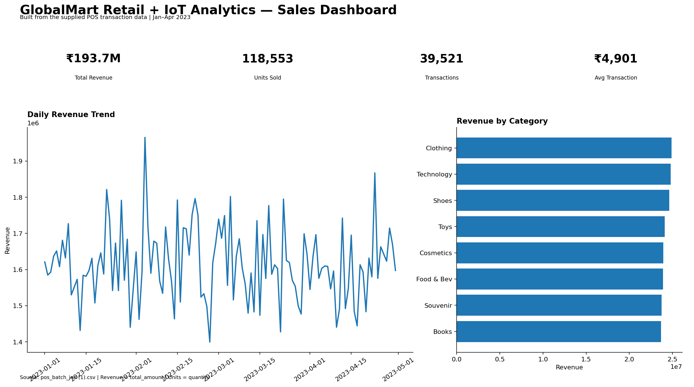
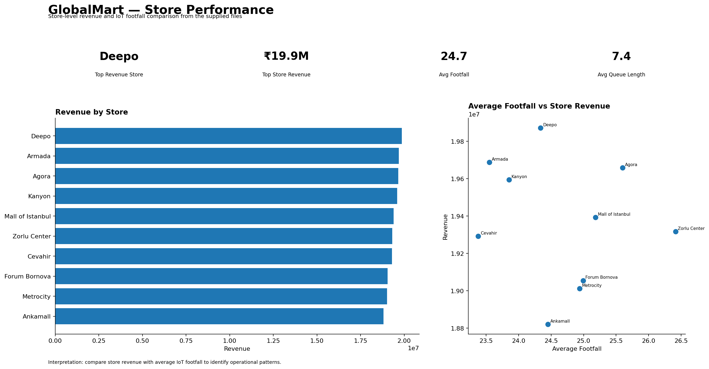
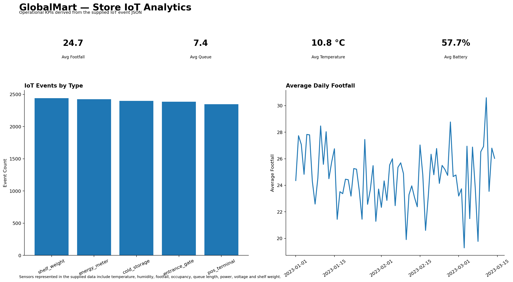
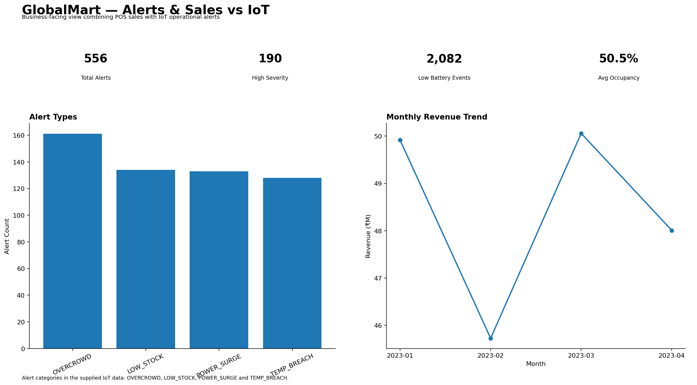

# GlobalMart Retail + IoT Analytics

An end-to-end Retail and IoT Analytics project built using **AWS S3, Snowflake, SQL, Python, and Power BI** to transform raw retail, ERP, and IoT data into business-ready analytics.

## 📊 Project Overview

This project implements a modern data pipeline that ingests raw data from AWS S3, processes it through **Bronze, Silver, and Gold layers in Snowflake**, and delivers analytical insights through Power BI dashboards.

### Architecture

```text
AWS S3
   ↓
Snowflake External Stage
   ↓
Bronze Layer
   ↓
Data Cleaning & Transformation
   ↓
Silver Layer
   ↓
Business Transformations
   ↓
Gold / Analytics Layer
   ↓
Power BI Dashboards
```

## 🛠️ Technologies Used

* SQL
* Snowflake
* AWS S3
* Power BI
* Python
* Snowpipe
* Snowflake Streams
* ETL / Data Transformation

## 🗂️ Data Pipeline

### Bronze Layer

Raw data is ingested from AWS S3 into Snowflake.

Key concepts:

* Storage Integration
* External Stages
* File Formats
* COPY INTO
* CSV, JSON and Parquet data
* Snowpipe

### Silver Layer

The Silver layer contains cleaned and transformed data prepared for analytics.

Key datasets include:

* POS Transactions
* IoT Sensor Readings
* ERP Orders

Transformations include:

* Data cleaning
* Data type handling
* SQL transformations
* Data validation
* Business-ready data preparation

### Gold Layer

The Gold layer contains analytical tables designed for reporting and business analysis.

Key analytical tables:

* `FCT_DAILY_SALES`
* `FCT_GROSS_MARGIN`
* `FCT_STORE_IOT_DAILY`
* `FCT_SALES_VS_IOT`

Analytical views and materialized views were also created for revenue, category performance, margin, and IoT analysis.

## 📈 Power BI Dashboard

The Gold layer was connected to Power BI to create dashboards covering:

* Sales Performance
* Revenue Analysis
* Gross Margin
* Store Performance
* IoT Analytics
* Sales vs IoT Analysis

### Dashboard Preview

#### 1. Sales Dashboard



#### 2. Store Performance Dashboard



#### 3. IoT Operations Dashboard



#### 4. Alerts & Sales Dashboard



## 📁 Repository Structure

```text
GlobalMart-Retail-IoT-Analytics/
│
├── bronze/
│   └── Raw data ingestion and Bronze layer SQL
│
├── silver/
│   └── Data cleaning and transformation SQL
│
├── gold/
│   └── Analytical tables, views and Gold layer SQL
│
├── setup/
│   └── Snowflake and AWS S3 setup scripts
│
├── 01_Sales_Dashboard.png
├── 02_Store_Performance.png
├── 03_IoT_Operations_Dashboard.png
├── 04_Alerts_Sales_Dashboard.png
│
└── README.md
```

## 🎯 Key Learning Outcomes

* Built a layered data warehouse architecture using Snowflake
* Worked with AWS S3 as a cloud data source
* Implemented ETL and data transformation workflows
* Used Snowpipe for automated data ingestion
* Worked with Snowflake Streams for change tracking
* Created analytical data models for Power BI
* Developed business dashboards for retail and IoT analytics
* Worked with SQL for data extraction, transformation, validation, and analysis

## 👤 Author

**Hardik Sharma**

BCA Student | Data Analytics

**Skills:** SQL | Python | Power BI | Snowflake | AWS S3 | Excel | Git & GitHub
